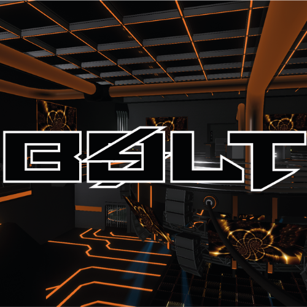

<div align="center">



# ⚡ BoltEVM Quai Miner
### The Ultimate Open-Source Hybrid Mining Solution for the Quai Network

[](https://opensource.org/licenses/MIT)
[]()
[]()

---

[Features](#-features) • [Installation](#-installation) • [Hardware Detection](#-hardware-detection) • [Build System](#-build-system) • [Rewards](#-rewards) • [Contributing](#-contributing)

</div>

---

## ✨ Features

- **⚡ 1-Click Setup Wizard** — Intelligent 6-step automated configuration. Handles hardware detection, toolchain validation, source compilation, and wallet setup.
- **⛏️ KawPow Mining Engine** — Powered by the official Quai **KawPow** PoW algorithm for high-efficiency GPU mining.
- **🔄 Hybrid Mining Mode** — Switch between **GPU Solo**, **CPU Solo**, or **Dual Mining** (GPU + CPU) from the same interface.
- **🐧 Cross-Platform (Windows & Linux)** — Full native support for both Windows (MSVC) and Linux (GCC/Make) build environments.
- **🖥️ Full Hardware Detection** — Detects NVIDIA/AMD GPUs and CPU cores using platform-native commands on both Windows and Linux.
- **🔬 Live Dependency Check** — Pre-flight environment scan before build: checks CMake, Git, GCC/MSVC, Make, and OpenSSL headers.
- **🔧 Auto-Repair Environment** — One-click toolchain installer: `winget` on Windows, `sudo apt-get` on Linux.
- **📊 Real-time Analytics** — Live network hashrate derived from on-chain block difficulty, block height, and wallet balance via Quai RPC.
- **💎 Premium UI** — Glassmorphism-based dark dashboard with animated stats, mining console, and chain data.

---

## 🛠️ Installation

### Prerequisites

| Tool | Windows | Linux |
|------|---------|-------|
| Node.js v18+ | [nodejs.org](https://nodejs.org/) | `apt install nodejs` |
| pnpm | `npm i -g pnpm` | `npm i -g pnpm` |
| Git | [git-scm.com](https://git-scm.com/) | `apt install git` |

### Quick Start

```bash
# Clone the repository (with GPU miner submodule)
git clone --recurse-submodules https://github.com/BOLTEVM/BOLTEVM-Quai-Miner.git

cd BOLTEVM-Quai-Miner

# Install Node dependencies
pnpm install

# Start the development server
pnpm --filter miner-ui dev
```

The UI is available at `http://localhost:4000`.

---

## 🔍 Hardware Detection

BoltEVM auto-detects your hardware at startup using platform-native commands.

### Windows
- **GPU**: PowerShell `Get-CimInstance Win32_VideoController`
- **CPU**: PowerShell `Get-CimInstance Win32_Processor`

### Linux
- **GPU**: `nvidia-smi -L` for NVIDIA cards; falls back to `lspci | grep -iE 'vga|3d|display'`
- **CPU**: `lscpu` → Model name, cores, threads; falls back to `/proc/cpuinfo` on minimal distros (Alpine, etc.)

---

## 🔬 Build System & Dependency Handling

The 1-Click Setup Wizard performs a **pre-flight environment check** before compiling the native GPU miner.

### Dependency Check (`/api/check-deps`)

| Dependency | Windows | Linux |
|-----------|---------|-------|
| CMake | `cmake --version` | `cmake --version` |
| Git | `git --version` | `git --version` |
| Compiler | Visual Studio 2017–2022 via `vswhere.exe` | `g++ --version` |
| Perl | Strawberry Perl | — |
| Make | — | `make --version` |
| OpenSSL Headers | — | `pkg-config --modversion openssl` |

### Auto-Repair Environment

If dependencies are missing, click **"Auto-Repair Environment (Install Toolchain)"**:
- **Windows**: Installs CMake and Strawberry Perl via `winget`
- **Linux**: Runs `sudo apt-get install -y cmake build-essential libssl-dev git pkg-config`

> **Note (Linux)**: Auto-repair requires passwordless `sudo`. If it fails, run the command manually in your terminal.

### Native Build (`/api/miner/build`)

| Phase | Windows | Linux |
|-------|---------|-------|
| Submodule Init | `git submodule update --init --recursive` | Same |
| CMake Configure | `-G "Visual Studio 17 2022" -A x64` (auto-detected) | Standard Makefiles |
| Compile | `cmake --build . --config Release` | `make -j$(nproc)` |

---

## 💰 Rewards & Payouts

The miner connects directly to the **Quai Cyprus-1 Zone RPC**. Enter your wallet in the Setup Wizard to:

- Monitor **live on-chain balance** via `quai_getBalance`
- Track **network hashrate** derived from block difficulty + average block time
- View **block height** via `quai_blockNumber`

> Wallet validation enforces the `0x` prefix and 40-character hex to prevent misconfigured payout addresses.

---

## 🖥️ Architecture

```
BOLTEVM-Quai-Miner/
├── apps/
│   ├── miner-ui/                   # Next.js 14 App Router frontend
│   │   ├── src/app/
│   │   │   ├── page.tsx            # Dashboard (hashrate, stats, console)
│   │   │   ├── setup/              # 6-Step Setup Wizard
│   │   │   └── api/
│   │   │       ├── hardware/       # Cross-platform GPU/CPU detection
│   │   │       ├── check-deps/     # Pre-flight toolchain validation
│   │   │       ├── quai/           # Live RPC stats (block height, hashrate, balance)
│   │   │       └── miner/
│   │   │           ├── build/      # CMake/Make native build pipeline
│   │   │           └── setup-env/  # Auto-install toolchain (winget / apt-get)
│   │   └── src/workers/
│   │       └── miner.worker.ts     # Browser Web Worker (simulated hash pipeline)
│   └── quai-gpu-miner/             # Official Quai GPU miner (git submodule)
└── pnpm-workspace.yaml
```

---

## 🤝 Contributing

We welcome contributions! To add support for new hardware, distributions, or mining algorithms:

1. Fork the Project
2. Create your Feature Branch (`git checkout -b feature/AmazingFeature`)
3. Commit your Changes (`git commit -m 'Add some AmazingFeature'`)
4. Push to the Branch (`git push origin feature/AmazingFeature`)
5. Open a Pull Request

---

<div align="center">

### Built with ❤️ for the Quai Network Community
**[Visit Website](https://quai.network)** • **[Join Discord](https://discord.gg/quai)**

</div>
